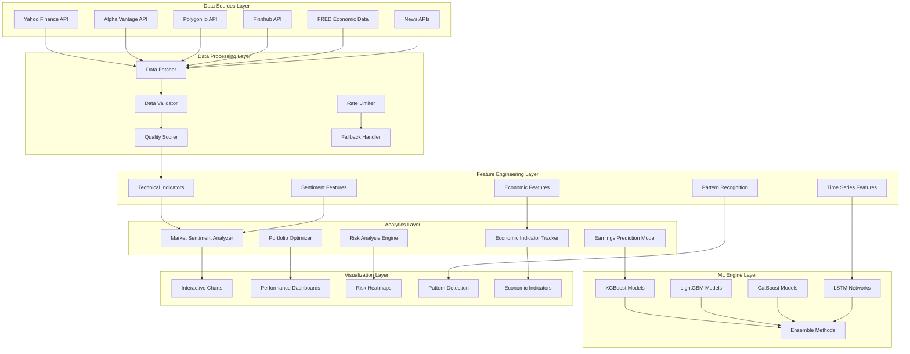
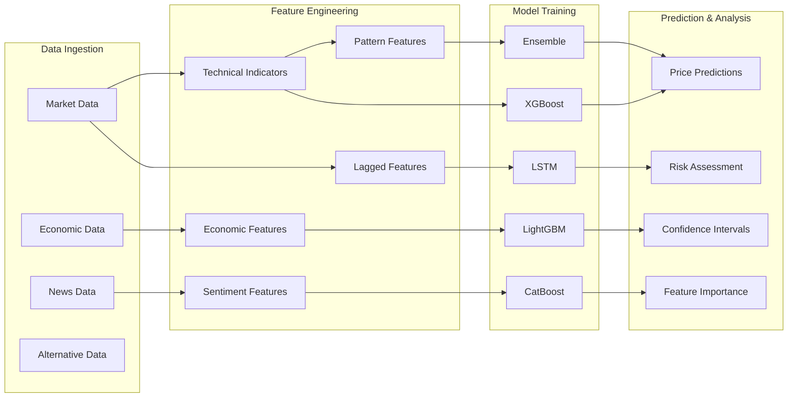
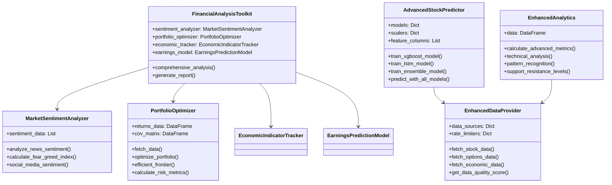

# 📊 Financial Data Analysis Toolkit

[](https://www.python.org/downloads/)
[](https://opensource.org/licenses/MIT)
[](https://jupyter.org/)
[](https://scikit-learn.org/)

A comprehensive suite of **advanced financial analysis tools** featuring machine learning models, enhanced data sources, interactive analytics, market sentiment analysis, portfolio optimization, economic indicator tracking, and earnings prediction models.

## 📋 Table of Contents
- [🏗️ Architecture](#%EF%B8%8F-architecture)
- [🚀 Enhanced Features](#-enhanced-features)
- [🛠️ Installation](#%EF%B8%8F-installation)
- [📋 Dependencies](#-dependencies)
- [🔥 Quick Start Examples](#-quick-start-examples)
- [🔮 Machine Learning Features](#-machine-learning-features)
- [📊 Interactive Visualizations](#-interactive-visualizations)
- [🎯 Performance Metrics](#-performance-metrics)
- [🚫 Risk Disclaimer](#-risk-disclaimer)
- [📝 License](#-license)

## 🏗️ Architecture

### System Overview


### Machine Learning Pipeline


### Component Interaction


## 🚀 Enhanced Features

### Core Analysis Tools
- **📰 Market Sentiment Analysis**: Advanced news sentiment analysis and Fear & Greed Index calculation
- **📈 Portfolio Optimization**: Modern Portfolio Theory with efficient frontier and risk-adjusted returns
- **🏦 Economic Indicator Tracking**: Real-time monitoring of key economic indicators and trends
- **🤖 Earnings Prediction**: Machine learning-based earnings forecasting with confidence intervals
- **📊 Risk Analysis**: Comprehensive risk metrics including VaR, CVaR, drawdown analysis
- **📉 Technical Analysis**: Advanced technical indicators with pattern recognition

### 🤖 Advanced Machine Learning Models
- **Multi-Model Approach**: XGBoost, LightGBM, CatBoost, and LSTM ensemble models
- **Feature Engineering**: 30+ technical indicators, economic features, and sentiment signals
- **Time Series Prediction**: LSTM networks for sequential pattern recognition
- **Ensemble Methods**: Voting regressors combining multiple algorithms
- **Hyperparameter Optimization**: Automated model tuning with cross-validation
- **Model Persistence**: Save and load trained models for production use

### 📡 Enhanced Data Sources Integration
- **Multiple Data Providers**: Alpha Vantage, Polygon.io, Finnhub, FRED integration
- **Fallback Mechanisms**: Automatic failover between data sources
- **Rate Limiting**: Built-in rate limiting and request management
- **Data Quality Scoring**: Automated data quality assessment and validation
- **Alternative Data**: Options chains, insider trading, news sentiment
- **Economic Data**: GDP, unemployment, inflation, interest rates

### 📊 Advanced Analytics & Visualization
- **Interactive Charts**: Plotly-based multi-panel technical analysis charts
- **Performance Dashboards**: Comprehensive risk and return metrics visualization
- **Pattern Recognition**: Automated detection of head & shoulders, triangles, double tops/bottoms
- **Support/Resistance**: Dynamic support and resistance level identification
- **Correlation Analysis**: Multi-asset correlation heatmaps and clustering
- **Advanced Metrics**: Sharpe, Sortino, Calmar ratios, Alpha, Beta calculations

## 🛠️ Installation

```bash
git clone https://github.com/olaitanojo/financial-data-analysis-toolkit.git
cd financial-data-analysis-toolkit
pip install -r requirements.txt
python main.py
```

## 📊 Sample Output

```
SENTIMENT ANALYSIS
Sentiment: Positive
Score: 0.127
Articles Analyzed: 10

FEAR & GREED INDEX
Overall Score: 62.3/100
Sentiment: Greed

INVESTMENT RECOMMENDATION
Recommendation: Buy
Score: 3
Factors:
  • Positive news sentiment
  • Positive earnings outlook
```

## 🔧 Core Components

### Traditional Analysis Tools
- **MarketSentimentAnalyzer**: News sentiment and fear/greed analysis
- **PortfolioOptimizer**: Modern Portfolio Theory optimization
- **EconomicIndicatorTracker**: Economic data monitoring
- **EarningsPredictionModel**: ML earnings forecasting

### Enhanced Components
- **AdvancedStockPredictor**: Multi-model ML prediction system
- **EnhancedDataProvider**: Multi-source data aggregation with quality scoring
- **EnhancedAnalytics**: Advanced statistical analysis and pattern recognition
- **EnhancedVisualizer**: Interactive Plotly-based chart generation

## 🚀 Quick Start Examples

### Basic Analysis
```python
from main import FinancialAnalysisToolkit

# Initialize toolkit
toolkit = FinancialAnalysisToolkit()

# Run comprehensive analysis
analysis = toolkit.comprehensive_analysis("AAPL")
print(f"Recommendation: {analysis['recommendation']['recommendation']}")
```

### Advanced ML Predictions
```python
from advanced_ml_models import AdvancedStockPredictor

# Initialize predictor
predictor = AdvancedStockPredictor("AAPL")
predictor.fetch_enhanced_data(period="2y")
predictor.prepare_features_target()

# Train ensemble models
xgb_results = predictor.train_xgboost_model()
ensemble_results = predictor.train_ensemble_model()

# Make predictions
predictions = predictor.predict_with_all_models()
print(f"XGBoost Prediction: {predictions['xgboost']:.2f}% price change")
print(f"Ensemble Prediction: {predictions['ensemble']:.2f}% price change")
```

### Enhanced Data Sources
```python
import asyncio
from enhanced_data_sources import EnhancedDataProvider, create_data_source_config

async def fetch_enhanced_data():
    config = create_data_source_config()
    async with EnhancedDataProvider(config) as provider:
        # Multi-source stock data with fallbacks
        stock_data = await provider.fetch_stock_data("AAPL")
        
        # Alternative data sources
        sentiment_data = await provider.fetch_news_sentiment("AAPL")
        options_data = await provider.fetch_options_data("AAPL")
        insider_data = await provider.fetch_insider_trading("AAPL")
        
        # Data quality assessment
        quality = provider.get_data_quality_score(stock_data, "AAPL")
        print(f"Data quality: {quality['quality_score']}/100")

asyncio.run(fetch_enhanced_data())
```

### Advanced Analytics & Visualization
```python
from enhanced_analytics import EnhancedAnalytics, EnhancedVisualizer
import yfinance as yf

# Load data
data = yf.Ticker("AAPL").history(period="1y")

# Advanced analytics
analytics = EnhancedAnalytics()
analytics.load_data(data)

# Calculate comprehensive metrics
metrics = analytics.calculate_advanced_metrics()
print(f"Sharpe Ratio: {metrics['sharpe_ratio']:.3f}")
print(f"Max Drawdown: {metrics['max_drawdown']:.2f}%")
print(f"VaR (95%): {metrics['var_95']:.2f}%")

# Technical analysis with pattern recognition
technical = analytics.technical_analysis()
print(f"RSI: {technical['momentum']['rsi']:.1f}")
print(f"Support: ${technical['support_resistance']['nearest_support']:.2f}")

# Generate interactive visualizations
visualizer = EnhancedVisualizer()
chart = visualizer.create_comprehensive_chart(data, "AAPL Analysis")
chart.write_html("aapl_analysis.html")

dashboard = visualizer.create_performance_dashboard(metrics)
dashboard.write_html("performance_dashboard.html")
```

## 📋 Dependencies

### Core Requirements
- Python 3.8+
- pandas, numpy, scipy
- scikit-learn, yfinance
- matplotlib, seaborn, plotly

### Advanced Features (Optional)
- **ML Models**: XGBoost, LightGBM, CatBoost, TensorFlow
- **Data Sources**: aiohttp for async data fetching
- **Technical Analysis**: TA-Lib for advanced indicators
- **APIs**: Alpha Vantage, Polygon.io, Finnhub (API keys required)

## 🎯 Performance Metrics

The toolkit calculates comprehensive performance and risk metrics:

- **Return Metrics**: Total return, annualized return, CAGR
- **Risk Metrics**: Volatility, max drawdown, downside deviation
- **Risk-Adjusted**: Sharpe ratio, Sortino ratio, Calmar ratio
- **Distribution**: Skewness, kurtosis, VaR, CVaR
- **Market Exposure**: Alpha, beta, correlation analysis

## 🔮 Machine Learning Features

### Supported Models
1. **XGBoost**: Gradient boosting with hyperparameter tuning
2. **LightGBM**: Fast gradient boosting for large datasets
3. **CatBoost**: Categorical feature handling
4. **Random Forest**: Ensemble decision trees
5. **LSTM**: Deep learning for time series
6. **Ensemble**: Voting classifier combining all models

### Feature Engineering
- **Technical Indicators**: 30+ indicators (RSI, MACD, Bollinger Bands, etc.)
- **Price Patterns**: Support/resistance, moving averages, momentum
- **Volume Analysis**: OBV, VPT, volume ratios
- **Economic Features**: Interest rates, GDP, inflation
- **Sentiment Features**: News sentiment, social media sentiment

## 📊 Interactive Visualizations

### Chart Types
- **Candlestick Charts**: OHLC data with volume
- **Technical Indicators**: RSI, MACD, Bollinger Bands overlays
- **Performance Dashboards**: Risk-return scatter plots
- **Correlation Heatmaps**: Multi-asset correlation analysis
- **Economic Indicators**: Time series of economic data

### Export Formats
- HTML (interactive Plotly charts)
- PNG/SVG (static images)
- PDF reports
- CSV/Excel data exports

## 🚨 Risk Disclaimer

This toolkit is for educational and research purposes only. It does not constitute financial advice. Always conduct your own research and consult with financial professionals before making investment decisions.

## 📄 License

MIT License - see LICENSE file for details

---
**Created by [olaitanojo](https://github.com/olaitanojo)**

*Advanced Financial Analysis Toolkit with Machine Learning, Enhanced Data Sources, and Interactive Analytics*
